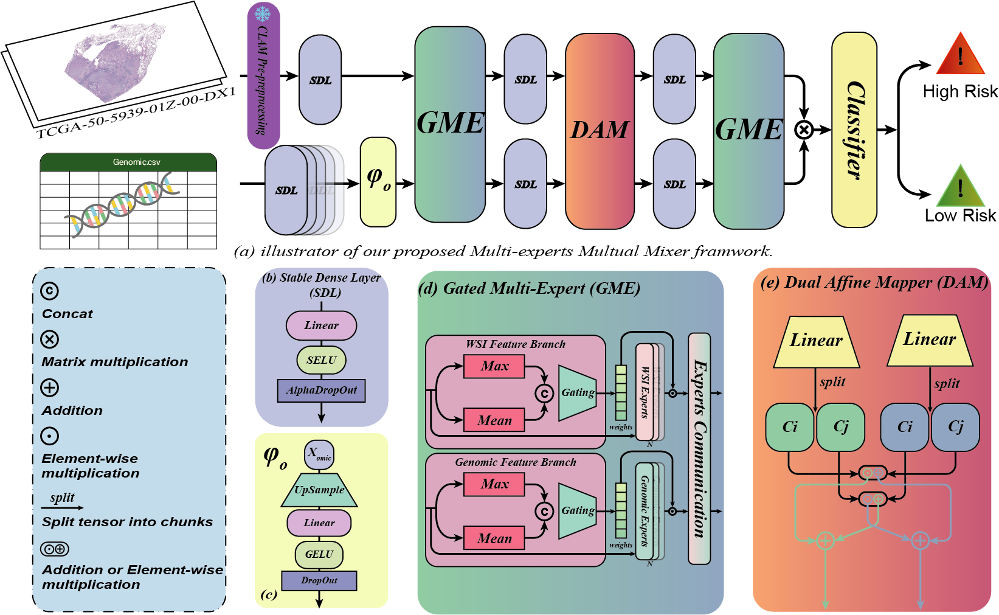

### **MMM: A Lightweight Framework for Multi-modal Mutual Mixer in Cancer Survival Prediction**

<p align="center"><i>Anonymized Authors</i></p>
<p align="center"><i>email@anonymized.com</i></p>





**Abstract**:Survival analysis is a critical task in prognostic treatment, often requiring the integration of Whole Slide Images (WSIs) and genomic data. This task presents several significant challenges, including substantial computational demands and the inherent heterogeneity between these two modalities. Existing approaches primarily rely on attention mechanisms with multiple stacked layers, which tend to introduce excessive redundant computations and large parameter counts, limiting their practicality in real-world clinical scenarios. To address these challenges, we propose the Multi-experts Mutual Mixer (MMM), a lightweight yet powerful framework designed to efficiently integrate and interact with multi-modal data. Within this framework, we introduce the Gated-Multi Experts (GME) mechanism, which dynamically assigns expert weights based on modality-specific features and employs a compact softmax router to select expert pairs. Inspired by multidisciplinary consultations in clinical practice, this design simulates iterative meetings between gene and image experts, enabling effective feature alignment through multi-round Gaussian position-biased interactions while avoiding unnecessary complexity. To further improve efficiency, we incorporate the Dual Affine Mapper (DAM) module, which leverages dual affine transformations to extract complementary modality-specific components and modulate one modality’s features with parameters derived from the other. Extensive experiments demonstrate that our model not only achieves state-of-the-art (SOTA) performance on multiple survival prediction benchmarks but also maintains a significantly reduced parameter count and computational footprint. This efficiency is consistently observed across the TCGA-BLCA, TCGA-UCEC, and TCGA-LUAD datasets, highlighting its potential for practical deployment in clinical settings.


### Hardware and Software. 
MMM model is implemented using PyTorch 2.1.2 with CUDA 11.8 and is trained with Python 3.10.15. The training process is conducted on an Ubuntu 22.04.4 LTS system, utilizing four NVIDIA RTX 4090 GPUs.

### TCGA Dataset download guide
Frist download the manifest form TCGA GDC Data Portal and run:
```bash
python ./clean_txt.py # You may modify some paths
nohup bash ./download_tcga.sh > download.log 2>&1 & # You may modify some paths
```

### Preprocessing
Thanks to the excellent work done by [CLAM](https://github.com/mahmoodlab/CLAM/tree/master). In this step, we used codes of [CLAM](https://github.com/mahmoodlab/CLAM/tree/master). Please refer to their original repository on how to process your WSIs into features.

Run following code to create patches and extract features.:
```bash
python create_patches_fp.py --source DATA_DIRECTORY --save_dir RESULTS_DIRECTORY --patch_size 512 --seg --patch --stitch 
```
```bash
CUDA_VISIBLE_DEVICES=0 python extract_features_fp.py --data_h5_dir DIR_TO_COORDS --data_slide_dir DATA_DIRECTORY --csv_path CSV_FILE_NAME --feat_dir FEATURES_DIRECTORY --batch_size 512 --slide_ext .svs
```
The data structure is as follows:
```bash
DATA_ROOT_DIR/
    ├──DATASET_1_DATA_DIR/
        └── pt_files
                ├── slide_1.pt
                ├── slide_2.pt
                └── ...
    ├──DATASET_2_DATA_DIR/
        └── pt_files
                ├── slide_a.pt
                ├── slide_b.pt
                └── ...
    └──DATASET_3_DATA_DIR/
        └── pt_files
                ├── slide_i.pt
                ├── slide_ii.pt
                └── ...
    └── ...
```

### Training Splits and Genomic Data.
The split files and genomic data are from [MCAT](https://github.com/mahmoodlab/MCAT/tree/master). To save space of this repository, please download the preprocessed genomics and splits from [MCAT](https://github.com/mahmoodlab/MCAT/tree/master) and put the folders within this project.

### Dependencies
```bash
pip install -r requirements.txt
```
If you encounter issues while installing torch or scikit-survival, you can download the wheel file and run the following command:
```bash
pip install xxx.whl
``` 

### Run experiments
```bash
CUDA_VISIBLE_DEVICES=0 nohup python3 main.py \
    --data_root_dir ./TCGA_LUAD_pt \ 
    --split_dir tcga_luad \
    --model_type mmm \
    --apply_sig \
    --exp_name mmm_luad \
    --wandb \
    > ./mmm_luad.log 2>&1 &


CUDA_VISIBLE_DEVICES=1 nohup python3 main.py \
    --data_root_dir ./TCGA_BLCA_pt \
    --split_dir tcga_blca \
    --model_type mmm \
    --apply_sig \
    --exp_name mmm_blca \
    --wandb \
    > ./mmm_blca.log 2>&1 &    


CUDA_VISIBLE_DEVICES=2 nohup python3 main.py \
    --data_root_dir ./TCGA_UCEC_pt \
    --split_dir tcga_ucec \
    --model_type mmm \
    --apply_sig \
    --exp_name mmm_ucec \
    --wandb \
    > ./mmm_ucec.log 2>&1 &  

```
The command will run on different GPUs. You can modify the GPU number based on your available hardware. **If you don't want to upload data to wandb you can remove --wandb.**

### Issues
Please report all issues to [GitHub](https://github.com/jermmy19998/MMM/issues), or feel free to send an [e-mail](email@anonymized.com) directly to me.

### Acknowledgement
This repository is built upon [MoME](https://github.com/BearCleverProud/MoME), [CLAM](https://github.com/mahmoodlab/CLAM/tree/master), [MCAT](https://github.com/mahmoodlab/MCAT/tree/master)  and [MOTCAT](https://github.com/Innse/MOTCat). We sincerely thank them for their outstanding contributions, which have significantly accelerated our progress!

### Code Coming soon
### Reference
If you find our work useful in your research or if you use parts of this code please consider citing our paper:
```bash
```

### LICENSE
This project is licensed under the Creative Commons BY-NC (Attribution-NonCommercial) - see the [LICENSE.md](LICENSE.md) file for details.
