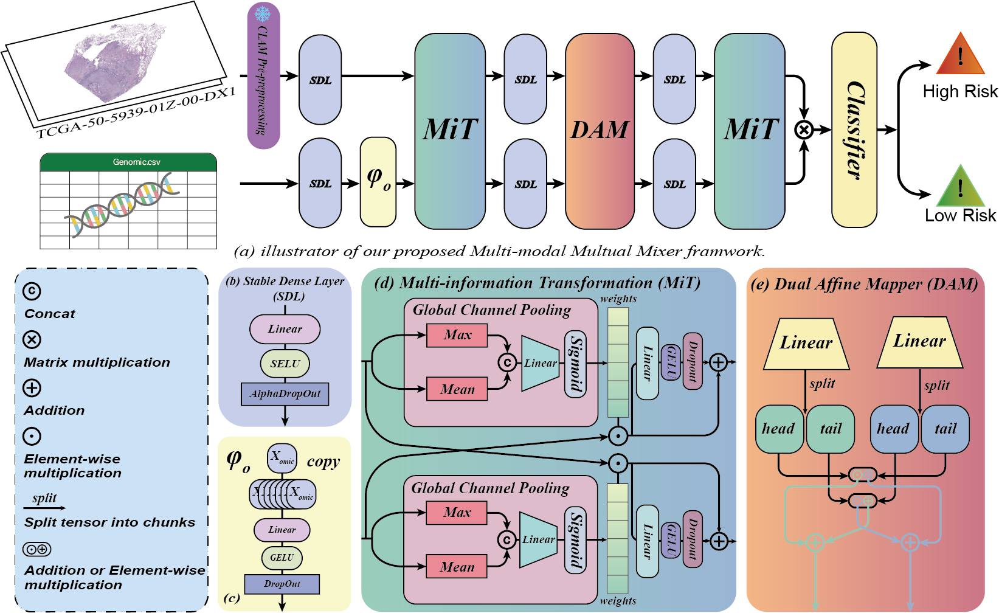

### **MMM: A Lightweight Framework for Multi-modal Mutual Mixer in Cancer Survival Prediction**

<p align="center"><i>Anonymized Authors</i></p>
<p align="center"><i>email@anonymized.com</i></p>




## Abstract

Survival analysis is a critical task in prognostic treatment, often requiring the integration of Whole Slide Images (WSIs) and genomic data. This task presents several significant challenges, including substantial computational demands and the inherent heterogeneity between these two modalities. Existing approaches primarily rely on attention mechanisms, which typically incorporate multiple attention layers in the intermediate and final stages of the models. However, these methods often generate excessive redundant information, leading to inefficiencies and limiting their practical applicability in real-world clinical scenarios. 

To address these challenges, we propose the **Multi-modal Mutual Mixer (MMM)**, a novel framework designed to optimize the integration and interaction of multi-modal data while ensuring practical efficiency. Within this framework, we introduce the **Multi-information Transmission (MiT)** mechanism, which dynamically generates feature weights from global information of the modality, enabling effective cross-modal alignment without unnecessary complexity. 

To further enhance feature interaction between WSIs and genomic data, we incorporate the **Dual Affine Mapper (DAM)** module. This module utilizes dual affine transformations to extract modality-specific features, decomposing each modality into two complementary components (head and tail), and modulating one modality’s features with the parameters derived from the other. 

Comprehensive experimental evaluations demonstrate that our model achieves **state-of-the-art (SOTA)** performance in overall scoring, while requiring **12 times fewer parameters** compared to the previous SOTA. This efficiency is consistently observed across multiple datasets, including TCGA-BLCA, TCGA-UCEC, and TCGA-LUAD.


### Hardware and Software. 
MMM is implemented in PyTorch 2.1.2+cu118 with
Python 3.10.15, and trained on an Ubuntu 22.04.4 LTS system with 4 NVIDIA
RTX 4090 GPUs.

### TCGA Dataset download guide
Frist download the manifest form TCGA GDC Data Portal and run:
```bash
python ./clean_txt.py # You may modify some paths
nohup bash ./download_tcga.sh > download.log 2>&1 & # You may modify some paths
```

### Preprocessing
Thanks to the excellent work done by [CLAM](https://github.com/mahmoodlab/CLAM/tree/master). In this step, we used codes of [CLAM](https://github.com/mahmoodlab/CLAM/tree/master). Please refer to their original repository on how to process your WSIs into features.

Run following code to create patches and extract features.:
```bash
python create_patches_fp.py --source DATA_DIRECTORY --save_dir RESULTS_DIRECTORY --patch_size 512 --seg --patch --stitch 
```
```bash
CUDA_VISIBLE_DEVICES=0 python extract_features_fp.py --data_h5_dir DIR_TO_COORDS --data_slide_dir DATA_DIRECTORY --csv_path CSV_FILE_NAME --feat_dir FEATURES_DIRECTORY --batch_size 512 --slide_ext .svs
```
The data structure is as follows:
```bash
DATA_ROOT_DIR/
    ├──DATASET_1_DATA_DIR/
        └── pt_files
                ├── slide_1.pt
                ├── slide_2.pt
                └── ...
    ├──DATASET_2_DATA_DIR/
        └── pt_files
                ├── slide_a.pt
                ├── slide_b.pt
                └── ...
    └──DATASET_3_DATA_DIR/
        └── pt_files
                ├── slide_i.pt
                ├── slide_ii.pt
                └── ...
    └── ...
```

### Training Splits and Genomic Data.
The split files and genomic data are from [MCAT](https://github.com/mahmoodlab/MCAT/tree/master). To save space of this repository, please download the preprocessed genomics and splits from [MCAT](https://github.com/mahmoodlab/MCAT/tree/master) and put the folders within this project.

### Dependencies
```bash
pip install -r requirements.txt
```
If you encounter issues while installing torch or scikit-survival, you can download the wheel file and run the following command:
```bash
pip install xxx.whl
``` 

### Run experiments
```bash
CUDA_VISIBLE_DEVICES=0 nohup python3 main.py \
    --data_root_dir ./TCGA_LUAD_pt \ 
    --split_dir tcga_luad \
    --model_type mmm \
    --apply_sig \
    --exp_name mmm_luad \
    --wandb \
    > ./mmm_luad.log 2>&1 &


CUDA_VISIBLE_DEVICES=1 nohup python3 main.py \
    --data_root_dir ./TCGA_BLCA_pt \
    --split_dir tcga_blca \
    --model_type mmm \
    --apply_sig \
    --exp_name mmm_blca \
    --wandb \
    > ./mmm_blca.log 2>&1 &    


CUDA_VISIBLE_DEVICES=2 nohup python3 main.py \
    --data_root_dir ./TCGA_UCEC_pt \
    --split_dir tcga_ucec \
    --model_type mmm \
    --apply_sig \
    --exp_name mmm_ucec \
    --wandb \
    > ./mmm_ucec.log 2>&1 &  

```
The command will run on different GPUs. You can modify the GPU number based on your available hardware. **If you don't want to upload data to wandb you can remove --wandb.**

### Issues
Please report all issues to [GitHub](https://github.com/jermmy19998/MMM/issues), or feel free to send an [e-mail](email@anonymized.com) directly to me.

### Acknowledgement
This repository is built upon [MoME](https://github.com/BearCleverProud/MoME), [CLAM](https://github.com/mahmoodlab/CLAM/tree/master), [MCAT](https://github.com/mahmoodlab/MCAT/tree/master)  and [MOTCAT](https://github.com/Innse/MOTCat). We sincerely thank them for their outstanding contributions, which have significantly accelerated our progress!

### Reference
If you find our work useful in your research or if you use parts of this code please consider citing our paper:
```bash
```

### LICENSE
This project is licensed under the Creative Commons BY-NC (Attribution-NonCommercial) - see the [LICENSE.md](LICENSE.md) file for details.
