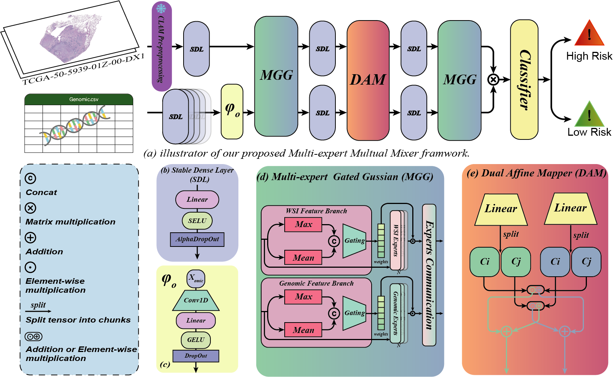

### **MMM: A Lightweight Framework for Multi-expert Mutual Mixer in Cancer Survival Prediction**

<p align="center"><i>Anonymized Authors</i></p>
<p align="center"><i>email@anonymized.com</i></p>





**Abstract**:Survival analysis is a critical task in prognostic treatment, often requiring the integration of Whole Slide Images (WSIs) and genomic data. However, this task presents significant challenges, including high computational overhead and the intrinsic heterogeneity of multimodal features. Existing approaches predominantly rely on attention-based architectures with deep stacked layers, which tend to introduce excessive redundancy and large parameter footprints, limiting their practicality in clinical scenarios. To address these challenges, we propose the Multi-expert Mutual Mixer (MMM), a lightweight yet expressive framework that enables efficient and dynamic interaction across modalities. Central to MMM is the Multi-expert Gated Gaussian (MGG) module, which decomposes features into modality-specific experts and employs a dual-stream gating network to assign instance-wise importance scores. To facilitate effective cross-modal collaboration, we further design a streamlined Expert Communication (EC) mechanism, inspired by clinical multidisciplinary consultations. EC first uses a compact global softmax router to perform multi-round voting based on the MGG scores, selecting the most relevant expert pairs from different modalities. These selected expert pairs then undergo Gaussian position-biased interaction for fine-grained alignment between image and gene representations. Additionally, a Dual Affine Mapper (DAM) module is incorporated to extract complementary modality-specific statistics and modulate one modality’s representation using affine parameters derived from the other. Extensive experiments on TCGA-BLCA, TCGA-UCEC, and TCGA-LUAD datasets demonstrate that our model achieves state-of-the-art (SOTA) performance in survival prediction while maintaining a significantly reduced parameter count and computation cost, underscoring its potential for practical clinical deployment.


### Hardware and Software. 
MMM model is implemented using PyTorch 2.1.2 with CUDA 11.8 and is trained with Python 3.10.15. The training process is conducted on an Ubuntu 22.04.4 LTS system, utilizing four NVIDIA RTX 4090 GPUs.

### TCGA Dataset download guide
Frist download the manifest form TCGA GDC Data Portal and run:
```bash
python ./clean_txt.py # You may modify some paths
nohup bash ./download_tcga.sh > download.log 2>&1 & # You may modify some paths
```

### Preprocessing
Thanks to the excellent work done by [CLAM](https://github.com/mahmoodlab/CLAM/tree/master). In this step, we used codes of [CLAM](https://github.com/mahmoodlab/CLAM/tree/master). Please refer to their original repository on how to process your WSIs into features.

Run following code to create patches and extract features.:
```bash
python create_patches_fp.py --source DATA_DIRECTORY --save_dir RESULTS_DIRECTORY --patch_size 512 --seg --patch --stitch 
```
```bash
CUDA_VISIBLE_DEVICES=0 python extract_features_fp.py --data_h5_dir DIR_TO_COORDS --data_slide_dir DATA_DIRECTORY --csv_path CSV_FILE_NAME --feat_dir FEATURES_DIRECTORY --batch_size 512 --slide_ext .svs
```
The data structure is as follows:
```bash
DATA_ROOT_DIR/
    ├──DATASET_1_DATA_DIR/
        └── pt_files
                ├── slide_1.pt
                ├── slide_2.pt
                └── ...
    ├──DATASET_2_DATA_DIR/
        └── pt_files
                ├── slide_a.pt
                ├── slide_b.pt
                └── ...
    └──DATASET_3_DATA_DIR/
        └── pt_files
                ├── slide_i.pt
                ├── slide_ii.pt
                └── ...
    └── ...
```

### Training Splits and Genomic Data.
The split files and genomic data are from [MCAT](https://github.com/mahmoodlab/MCAT/tree/master). To save space of this repository, please download the preprocessed genomics and splits from [MCAT](https://github.com/mahmoodlab/MCAT/tree/master) and put the folders within this project.

### Dependencies
```bash
pip install -r requirements.txt
```
If you encounter issues while installing torch or scikit-survival, you can download the wheel file and run the following command:
```bash
pip install xxx.whl
``` 

### Run experiments
```bash
CUDA_VISIBLE_DEVICES=0 nohup python3 main.py \
    --data_root_dir ./TCGA_LUAD_pt \ 
    --split_dir tcga_luad \
    --model_type mmm \
    --apply_sig \
    --exp_name mmm_luad \
    --wandb \
    > ./mmm_luad.log 2>&1 &


CUDA_VISIBLE_DEVICES=1 nohup python3 main.py \
    --data_root_dir ./TCGA_BLCA_pt \
    --split_dir tcga_blca \
    --model_type mmm \
    --apply_sig \
    --exp_name mmm_blca \
    --wandb \
    > ./mmm_blca.log 2>&1 &    


CUDA_VISIBLE_DEVICES=2 nohup python3 main.py \
    --data_root_dir ./TCGA_UCEC_pt \
    --split_dir tcga_ucec \
    --model_type mmm \
    --apply_sig \
    --exp_name mmm_ucec \
    --wandb \
    > ./mmm_ucec.log 2>&1 &  

```
The command will run on different GPUs. You can modify the GPU number based on your available hardware. **If you don't want to upload data to wandb you can remove --wandb.**

### Issues
Please report all issues to [GitHub](https://github.com/jermmy19998/MMM/issues), or feel free to send an [e-mail](email@anonymized.com) directly to me.

### Acknowledgement
This repository is built upon [MoME](https://github.com/BearCleverProud/MoME), [CLAM](https://github.com/mahmoodlab/CLAM/tree/master), [MCAT](https://github.com/mahmoodlab/MCAT/tree/master)  and [MOTCAT](https://github.com/Innse/MOTCat). We sincerely thank them for their outstanding contributions, which have significantly accelerated our progress!

### Code Coming soon
### Reference
If you find our work useful in your research or if you use parts of this code please consider citing our paper:
```bash
```

### LICENSE
This project is licensed under the Creative Commons BY-NC (Attribution-NonCommercial) - see the [LICENSE.md](LICENSE.md) file for details.
